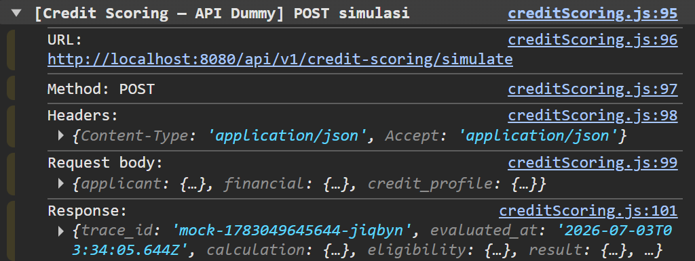

# Workshop Workbook — [NAMA ANDA]

**Frontend–Backend Integration & Debugging** · CreditApp Demo

> **Peserta:** salin file ini ke branch Anda, lalu isi bagian **Jawaban**.
>
> ```bash
> git checkout -b workshop/nama-anda
> cp docs/workshop/workbook.md.example docs/workshop/workbook-nama-anda.md
> ```
>
> Commit `workbook-<nama>.md` + tes Playwright di PR ke `main`.
>
> **Fasilitator** memakai file terpisah `workbook-fasilitator.md` (kunci jawaban, tidak di repo) — struktur sama, bagian 🔒 sudah terisi.

---

## Sesi 1 — Integration & Network

### Lab 1.1 — Happy path (checklist)

- [V] `[data-component="form-pengajuan"]`
- [V] `[data-component="verifikasi-dokumen"]`
- [V] `[data-component="scoring-loading"]`
- [V] `[data-component="hasil-scoring"]`
- [V] Trace ID: `mock-1783049645644-jiqbyn`

### Lab 1.2 — Network & Console

**1.2.A** — Ada POST ke `/api/v1/credit-scoring/simulate` saat `VITE_SCORING_MODE=mock`? Mengapa?

**Jawaban:**
```
Tidak Ada, karena kita memakai data mock, dan belum melakukan request ke mana pun
```
**1.2.B** — Field apa di log `[Credit Scoring — API Dummy]`? URL?

**Jawaban:**
URL: http://localhost:8080/api/v1/credit-scoring/simulate

Field yang ditampilkan:



**1.2.C** — Baris keputusan `mock` vs `uat` di `creditScoring.js`?

**Jawaban:**
```
Line 158

 @param {CreditScoringInput} input
 @returns {Promise<CreditScoringResponse>}
 
export async function scoreCreditApplication(input) {
  if (SCORING_MODE === 'uat') {
    return callUatBackend(input);
  }
  return scoreWithMock(input);
}
```

### Lab 1.3 — Diagram layer

```
[User click "Lanjut scoring otomatis"] → Store di-state "step: scoring" di function `attachVerifikasiDokumen` file VerifikasiDokumen.js → Memanggil function `scheduleScoring` di App.js → Render hasil scoring di file HasilScoring.js → [UI render hasil]
```

### Quiz Sesi 1

1. Browser, Frontend App, Backend API, Database
2. Karena mock terkadang tidak sync dengan API aslinya
3. scoreWithMock diproses menggunakan data dummy, sedangkan callUatBackend memanggil data dari backend

---

## Sesi 2 — Env & CORS

### Lab 2.1 — Matriks konfigurasi

| # | Konfigurasi | Hasil yang diamati | ✓/✗ |
|---|-------------|-------------------|-----|
| A | `mock` | | |
| B | `uat`, backend mati | | |
| C | `uat`, URL `:9999` | | |
| D | `uat`, path salah | | |

**2.1.A** — Pesan error skenario B (salin teks persis):

**2.1.B** — Status Network skenario C:

### Lab 2.2 — Debugging checklist (skenario 2.1.C)

| Layer | Temuan | Fix |
|-------|--------|-----|
| UI | | |
| Network | | |
| API | | |
| Config | | |
| Fix | | |

### Lab 2.3 — Playwright

- [V] `tests/workshop/intro/` — TODO peserta selesai, `npm run test:e2e:intro` hijau
- [V] `02-env-config.spec.js` — hapus `test.skip`, tes lulus
- [ ] `03-network-failure.spec.js` — `route.abort` (jika dikerjakan)

```
(paste output: npm run test:e2e)
PS D:\Project VSCode\MT Data Technology ECT\creditappdemo> npx playwright test --trace on
>> 

Running 14 tests using 1 worker

  ✓   1 …-happy-path.spec.js:9:3 › Happy path — mock scoring › form → verifikasi → hasil scoring dengan trace ID (5.5s)
  ✓   2 … tests\workshop\01-happy-path.spec.js:30:3 › Happy path — mock scoring › reset demo kembali ke formulir (3.2s)
  ✓   3 …shop\02-env-config.spec.js:13:3 › Env config — mock baseline › mock mode does not call real scoring API (3.2s)
  -   4 …\02-env-config.spec.js:38:8 › Env config — failure scenarios (peserta) › wrong backend URL shows scoring error
  -   5 …c.js:46:8 › Env config — failure scenarios (peserta) › request URL contains configured backend base (uat mode)
  -   6 …ailure.spec.js:14:8 › Network failure simulation › simulated API failure shows error state (requires uat mode)
  ✓   7 …rk-failure.spec.js:31:3 › Playwright intercept pattern (demo) › route.abort blocks matching URL pattern (1.1s)
  ✓   8 …1-page-load.spec.js:10:3 › Intro 1 — Page load › halaman utama menampilkan judul dan formulir pengajuan (1.0s)
  ✓   9 … › tests\workshop\intro\01-page-load.spec.js:19:3 › Intro 1 — Page load › field wajib formulir tersedia (1.0s)
  ✓  10 …interaction.spec.js:10:3 › Intro 2 — Form interaction › contoh: isi nama lengkap dan assert nilai input (1.1s)
  ✓  11 …p\intro\02-form-interaction.spec.js:24:3 › Intro 2 — Form interaction › TODO peserta: isi nomor telepon (1.1s)
  ✓  12 …\02-form-interaction.spec.js:35:3 › Intro 2 — Form interaction › TODO opsional: isi penghasilan bulanan (1.1s)
  ✓  13 …avigation.spec.js:20:3 › Intro 3 — Step navigation › formulir terisi dapat lanjut ke verifikasi dokumen (1.1s)
  ✓  14 …p-navigation.spec.js:38:3 › Intro 3 — Step navigation › TODO peserta: klik Periksa pada dokumen pertama (1.3s)

  3 skipped
  11 passed (29.5s)

To open last HTML report run:

  npx playwright show-report
```

### Lab 2.4 / Quiz Sesi 2

**2.4.A** — Mengapa browser memeriksa CORS?

**2.4.B** — Header response apa yang dibutuhkan untuk POST JSON?

Quiz 1–3:

---

## Sesi 3 — Trace ID & debugging

### Lab 3.1

- Trace ID di UI: `...`
- `trace_id` di Console: `...`
- Sama? Jika tidak, di layer mana hilang?

**3.1.B** — Cara mencari log di ELK/Grafana:

### Lab 3.3 — Case study (berpasangan)

**Skenario __** — Hipotesis 1 + cara bukti / Hipotesis 2 + cara bukti

### Quiz Sesi 3

1.
2.
3.

---

## Sesi 4 — Trace & pipeline

### Lab 4.1 — Playwright Trace Viewer

- Ada request scoring di tab Network trace? ...
- Step Snapshots: kapan `[data-component="hasil-scoring"]` muncul? ...
- Screenshot (opsional): `docs/workshop/bukti/<nama>/trace-4.1.png`

### Lab 4.2 — Happy path

- [ ] Tes lulus mode `mock`
- [ ] Tanpa `page.waitForTimeout()`
- [ ] Selector `data-component` atau role/label stabil

### Lab 4.3 — Pipeline (konseptual)

1.
2.
3.

---

## Assessment

### Bagian A — Pilihan ganda

1. _a b c d_
2. _a b c d_
3. _a b c d_
4. _a b c d_
5. _a b c d_

### Bagian B — Esai (502 di staging)

Langkah debugging terurut (min. 5):

1.
2.
3.
4.
5.

### Bagian C — Checklist praktik (fasilitator)

- [ ] Happy path manual
- [ ] Minimal 1 skenario error (Lab 2.1)
- [ ] Playwright happy-path lulus
- [ ] Checklist Lab 2.2 terisi
